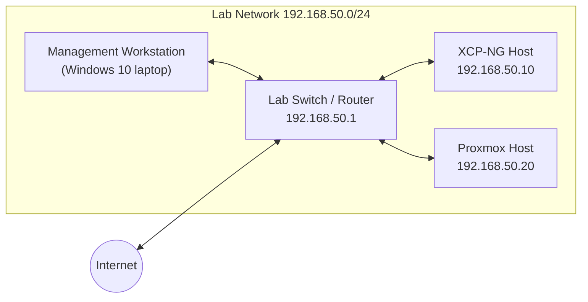
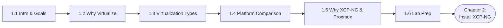
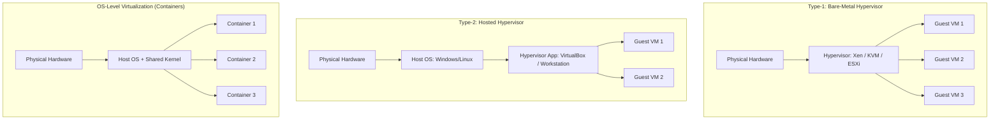

# Virtualization & Containerization Using Xen, KVM & LXC — XCP-NG & Proxmox
## A Step-by-Step Training Guidebook

*Based on the Course 2 Training Outline — 4 Chapters · 28 Sessions · ~12 Training Days*

**This file:** Chapter 1 of 4 — see `Chapter-2-Install-Configure-XCPNG.md`, `Chapter-3-Install-Configure-Proxmox.md`, and `Chapter-4-Storage-Administration.md` for the rest of the course.

---

## About This Guidebook

This guidebook expands the original Virtualization / Containerization training outline (Xen, KVM & LXC using XCP-NG and Proxmox VE) into a full step-by-step course book. It follows the same chapter and session numbering as the outline so trainer and students can move between the schedule and the book without any translation.

Each session in this book includes: a short goal statement, prerequisites, numbered step-by-step instructions, the exact commands to run, explanations of what each command does, and a short review checklist.

### Course Prerequisites

- A working understanding of Linux installation and basic IP/network configuration.
- One Windows 10 laptop (for remote access / management) and one dedicated workstation or server with a 2.4–3.0 GHz, 8-core processor and 16 GB RAM, reserved for the XCP-NG / Proxmox lab.
- A stable internet connection for downloading ISO images and packages.
- A USB flash drive (8 GB+) for creating bootable installation media.

### Lab Environment Overview

Throughout this book, the training lab consists of one bare-metal host running the hypervisor under test (XCP-NG in Chapters 1–2, Proxmox VE in Chapters 3–4), a management workstation on the same LAN, and at least one spare internal or external disk for storage exercises. A private lab network (e.g. `192.168.50.0/24`) is assumed unless a session states otherwise.


*Figure 1.1 — Lab network layout used throughout this course.*

### How the Course Is Scheduled

120 minutes per class, delivered 7:30 PM–11:30 PM (adjustable to student demand), at least 2 classes per week. Total planned duration: 15–25 class days.

### Notation Used in This Book

- Grey code blocks are exact commands to type into a terminal or shell.
- `> **Note:**` / `> **Warning:**` blocks call out gotchas.
- Each session ends with a short checklist.

---

# Chapter 1 — Introduction & Building the Foundation

*Day 01 – Day 02 | 6 Sessions | ~330 minutes total*

This chapter sets the conceptual foundation before any software is installed. Students leave this chapter understanding why virtualization matters, how the major hypervisor platforms differ, why XCP-NG and Proxmox were chosen for this course, and with their lab environment fully prepared for installation in Chapter 2.


*Figure 1.2 — Chapter 1 session flow.*

## Session 1.1 — Introductions, Objectives and Elaborating Training Goal
*(30 min, Day-01)*

**Session Goal:** Align the class on what will be built, in what order, and what "done" looks like.

### Steps
- Introduce trainer and students; capture each student's current Linux/networking experience level.
- Walk through the full course roadmap: Chapter 1 (concepts) → Chapter 2 (XCP-NG) → Chapter 3 (Proxmox) → Chapter 4 (storage & monitoring).
- State the end-of-course outcome: each student independently installs, configures, and manages two production-grade hypervisor platforms, including storage, snapshots, replication, and monitoring.
- Confirm every student has the required hardware (see Course Prerequisites) ready before Session 1.6.

> **Note:** If a student's workstation does not meet the 8-core/16GB minimum, plan to pair them with another student's machine for the hands-on labs — the lecture content still applies to everyone.

**Checklist**
- [ ] Roadmap explained and understood
- [ ] Hardware readiness confirmed for every student

## Session 1.2 — Virtualization is Everywhere! Why You Have to Learn It
*(30 min, Day-01)*

**Session Goal:** Build the business case for virtualization skills.

### Discussion Points
- Server consolidation: running many logical servers on one physical box cuts hardware, power, cooling, and rack-space cost.
- Isolation and safety: a crashed or compromised VM does not take down its neighbours.
- Agility: new VMs are provisioned in minutes instead of a hardware procurement cycle.
- Disaster recovery: snapshots and replication (covered in Chapter 2) make point-in-time recovery routine instead of exceptional.
- Career relevance: cloud platforms (AWS, Azure, GCP) and every modern ISP/enterprise data center are built on the same virtualization primitives taught in this course.

**Checklist**
- [ ] Can explain 3 business reasons to virtualize, in their own words

## Session 1.3 — Different Types of Virtualization Technology & Software
*(30 min, Day-01)*

**Session Goal:** Map the vocabulary before comparing specific products.

### Core Concepts
- **Type-1 (bare-metal) hypervisor:** runs directly on hardware — e.g. Xen, KVM/ESXi. Best performance, used in production.
- **Type-2 (hosted) hypervisor:** runs as an application on top of a host OS — e.g. VirtualBox, VMware Workstation. Good for labs/desktops, not production servers.
- **Full virtualization:** guest OS is unaware it is virtualized (KVM, ESXi).
- **Para-virtualization:** guest OS is modified to cooperate with the hypervisor for better performance (classic Xen PV).
- **OS-level virtualization / containers:** many isolated user-spaces share one kernel — lighter weight than a full VM (LXC, Docker).


*Figure 1.3 — Type-1 vs Type-2 hypervisors vs OS-level containers.*

### Where Each Fits in This Course
- XCP-NG — a free, enterprise-grade Type-1 hypervisor built on the Xen Project hypervisor.
- Proxmox VE — a free, enterprise-grade Type-1 platform built on KVM for full VMs and LXC for containers, in one web UI.

**Checklist**
- [ ] Can distinguish Type-1 vs Type-2
- [ ] Can distinguish full virtualization vs containers

## Session 1.4 — Comparison Among Several Virtualization Software (ESXi, Xen, KVM)
*(30 min, Day-01)*

**Session Goal:** Understand the trade-offs behind the platform choice for this course.

| Platform | Underlying Tech | License Cost | Management UI | Container Support |
|---|---|---|---|---|
| VMware ESXi | Proprietary bare-metal | Paid (free tier limited) | vSphere / vCenter | No (needs separate product) |
| XCP-NG | Xen Project (open source) | Free | Xen Orchestra / XCP-ng Center | No native, via VMs |
| Proxmox VE | KVM + LXC (open source) | Free (paid support optional) | Built-in Web UI | Yes, native LXC |

**Checklist**
- [ ] Can name one advantage and one limitation of each platform

## Session 1.5 — Why Use XCP-NG & Proxmox for Virtualization
*(30 min, Day-01)*

**Session Goal:** Justify the specific tools this course standardizes on.

### Why XCP-NG
- 100% free and open-source, with no artificial feature caps on the free tier (unlike ESXi's free edition).
- Mature, Xen-based live migration, storage replication, and high-availability features drawn from the commercial XenServer lineage.
- Pairs with Xen Orchestra for a full-featured centralized management console.

### Why Proxmox VE
- Combines full KVM virtual machines and lightweight LXC containers in a single, free, web-based platform.
- Built-in backup, clustering, and software-defined storage (ZFS, Ceph) without extra licensing.
- Large open community and frequent updates, making it a popular choice for SMB and hobbyist infrastructure alike.

**Checklist**
- [ ] Can justify the platform choice to a non-technical stakeholder

## Session 1.6 — Preparation for Virtual Lab for the Training Course
*(120 min, Day-02)*

**Session Goal:** Have a working, network-connected lab machine ready for installation in Chapter 2.

### Steps
1. Verify BIOS/UEFI virtualization extensions (Intel VT-x/VT-d or AMD-V/AMD-Vi) are enabled on the lab server.
2. Download the required ISOs in advance: XCP-NG installer ISO (xcp-ng.org), Proxmox VE installer ISO (proxmox.com), and a lightweight Linux ISO (Debian/Ubuntu netinst) for later use as a guest.
3. Create bootable USB installation media with Rufus (Windows) or `dd`/`balenaEtcher` (Linux/macOS).

```bash
# Linux/macOS example — replace /dev/sdX with your actual USB device
sudo dd if=xcp-ng-8.x.x.iso of=/dev/sdX bs=4M status=progress conv=fsync
```

> **Warning:** Double-check the target device with `lsblk` before running `dd` — writing to the wrong device destroys its data irrecoverably.

4. Sketch the lab network diagram (see Figure 1.1 above): management workstation, lab switch/router, and the hypervisor host's planned IP address.
5. Decide and record the static IP plan you will use in Chapter 2 (e.g. host management IP `192.168.50.10/24`, gateway `192.168.50.1`).

**Checklist**
- [ ] Virtualization extensions confirmed enabled in BIOS
- [ ] Both installer ISOs downloaded and written to USB
- [ ] Lab network/IP plan documented

**End of Chapter 1 Review: Q&A Session** — Before moving to Chapter 2, confirm every student can explain the difference between a hypervisor and a container, name the two platforms this course covers, and has a bootable installer ready to go.

---
**Next:** `Chapter-2-Install-Configure-XCPNG.md`
