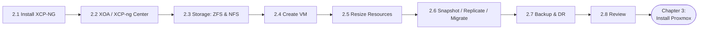
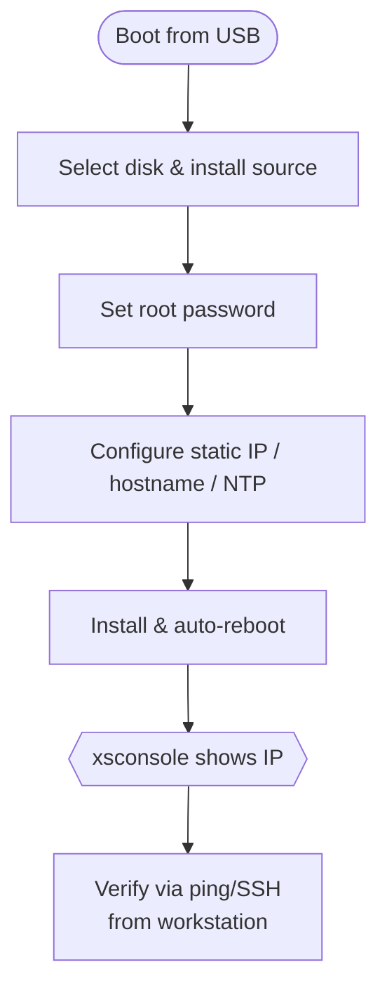
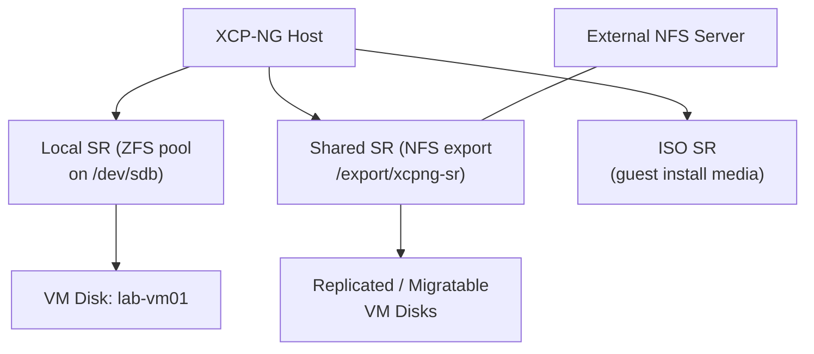
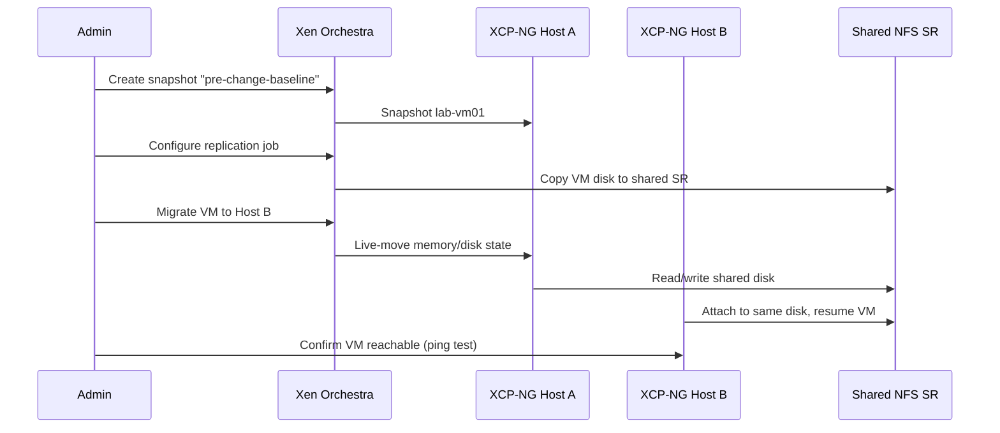
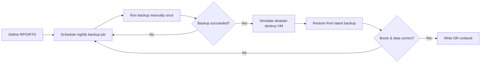

# Chapter 2 — Install & Configure XCP-NG

*Part 2 of 4 — Virtualization & Containerization Training Guidebook*
*Day 02 – Day 06 | 8 Sessions | ~615 minutes total*

**Previous:** `Chapter-1-Introduction-and-Foundation.md` **Next:** `Chapter-3-Install-Configure-Proxmox.md`

---

This chapter takes students from a blank server to a fully operational XCP-NG host: installed, patched, storage-configured, running virtual machines, and protected with snapshots, replication and a documented backup/restore procedure.


*Figure 2.1 — Chapter 2 session flow.*

## Session 2.1 — Install XCP-NG & Complete the Lab Preparation
*(90 min, Day-03)*

**Session Goal:** Get XCP-NG installed and reachable on the lab network.

### Steps
1. Boot the lab server from the XCP-NG USB installer created in Session 1.6.
2. At the welcome screen, select your keyboard layout and accept the license agreement.
3. Select the target installation disk (the local SSD/HDD dedicated to the hypervisor, not a data disk).
4. Choose the installation source: Local media.
5. Skip supplemental packs unless your lab specifically requires them.
6. Set the root password when prompted — record it in your lab notes.
7. Configure the primary network interface: select static IP, and enter the address, netmask, gateway and DNS server from your Session 1.6 plan.
8. Set the hostname (e.g. `xcpng-lab01`) and NTP time server (or set the clock manually).
9. Confirm installation; the installer copies files and reboots automatically. Remove the USB drive at reboot.
10. At first boot, the console shows the xsconsole management screen with the assigned IP — write this IP down.

```bash
# From your management workstation, verify the host answers on the network
ping 192.168.50.10
ssh root@192.168.50.10
```


*Figure 2.2 — XCP-NG installation flow.*

**Checklist**
- [ ] XCP-NG installed on dedicated disk
- [ ] Host reachable by ping and SSH from the workstation
- [ ] Root password recorded securely

## Session 2.2 — Basic Configuration of XCP-NG & Access with XCP-NG Center / Xen Orchestra
*(90 min, Day-03)*

**Session Goal:** Manage the host from a graphical console instead of the local xsconsole only.

### Steps
1. On the management workstation, install XCP-ng Center (Windows) or deploy Xen Orchestra (XOA) as a virtual appliance for cross-platform management.
2. For Xen Orchestra: import the XOA appliance VM into the pool, power it on, and note its assigned IP address.
3. Browse to `https://<XOA-IP>` and complete the initial setup wizard, creating an administrator account.
4. In XOA (or XCP-ng Center), add the XCP-NG host using its management IP and root credentials.
5. Explore the Dashboard, Host, and Storage tabs to confirm the host's CPU, memory, and disk are reporting correctly.
6. Apply any pending host patches from the Patches tab before proceeding.

> **Note:** Xen Orchestra Community edition is free but must be built/updated from source (`xo-server`/`xo-web`) rather than a signed appliance — budget extra lab time the first time you set it up.

**Checklist**
- [ ] Graphical management console connected to the host
- [ ] Host patches applied

## Session 2.3 — Storage Configuration for XCP-NG with ZFS & NFS
*(90 min, Day-04)*

**Session Goal:** Provide the host with usable Storage Repositories (SRs) for virtual disks and ISOs.

### Steps
1. Identify the spare disk to dedicate to storage (e.g. `/dev/sdb`) with `lsblk` over SSH on the host.
2. If using local ZFS storage, install the ZFS SR driver supplemental pack (or the community XCP-ng ZFS plugin) and create a pool:

```bash
zpool create -f data_pool /dev/sdb
zfs create data_pool/vmstore
```

3. Register the ZFS-backed path as a new Storage Repository from XOA: New → Storage → type "Local", pointing at the ZFS mount path.
4. For shared/NFS storage, set up an NFS export on a separate Linux server (e.g. `/export/xcpng-sr`) with the host's IP in `/etc/exports`, then reload NFS:

```bash
echo '/export/xcpng-sr 192.168.50.0/24(rw,no_subtree_check,no_root_squash)' >> /etc/exports
exportfs -ra
```

5. In XOA: New → Storage → NFS, enter the NFS server IP and export path, then attach it to the pool.
6. Create a dedicated ISO storage repository (NFS or local) and upload the Linux ISO downloaded in Session 1.6.

> **Note:** NFS storage is required (not optional) if you plan to test live migration between two XCP-NG hosts, since VM disks must be reachable from both.


*Figure 2.3 — XCP-NG storage repository layout.*

**Checklist**
- [ ] At least one local (ZFS) SR created
- [ ] At least one shared (NFS) SR created
- [ ] ISO SR populated with a guest ISO

## Session 2.4 — Upload ISO and Create Virtual Machine
*(90 min, Day-04)*

**Session Goal:** Build and boot a first guest virtual machine.

### Steps
1. In XOA, confirm the ISO uploaded in Session 2.3 is visible under the ISO storage repository.
2. Click New VM → select a template close to your guest OS (e.g. "Other install media" or a Debian/Ubuntu template if available).
3. Name the VM (e.g. `lab-vm01`), assign vCPUs (2) and RAM (2 GB) appropriate for a lab guest.
4. Attach a new virtual disk (20 GB) from the ZFS-backed SR created in Session 2.3.
5. Attach the uploaded ISO as the boot device and set boot order to CD-ROM first.
6. Attach the VM's virtual NIC to the correct network/VLAN.
7. Create and start the VM, then open its console from XOA and complete the guest OS installation as you would on physical hardware.
8. After the OS install finishes, detach the ISO and change boot order back to hard disk first.

**Checklist**
- [ ] VM created with disk, NIC and ISO attached
- [ ] Guest OS installed and boots from disk

## Session 2.5 — Understand & Modify Resources for Virtual Machine
*(60 min, Day-05)*

**Session Goal:** Confidently resize a VM's compute, memory and disk resources.

### Steps
1. Shut down `lab-vm01` cleanly from within the guest OS (or via XOA's Shutdown action).
2. In XOA, open the VM's Advanced tab and increase vCPU count; note that some changes need the VM powered off, while CPU hot-add may be available depending on the template.
3. Increase RAM allocation; observe Dynamic Memory settings (min/max) if Dynamic Memory Control is enabled.
4. Resize the virtual disk from the Storage tab, then extend the filesystem inside the guest OS to use the new space:

```bash
# Inside a Linux guest, after the virtual disk has been enlarged
sudo growpart /dev/xvda 1
sudo resize2fs /dev/xvda1     # ext4
# or for XFS:
sudo xfs_growfs /
```

5. Power the VM back on and confirm the new CPU/RAM/disk figures with `nproc`, `free -h`, and `df -h`.

> **Note:** Always confirm the exact device name (`xvda`, `vda`, `sda`) inside the guest before running resize commands — it varies by template and disk bus.

**Checklist**
- [ ] VM resource change verified from inside the guest OS

## Session 2.6 — Snapshot, Replication & Live Migration
*(60 min, Day-05)*

**Session Goal:** Protect and move a running VM without data loss.


*Figure 2.4 — Snapshot, replication and live-migration workflow.*

### Snapshots
1. In XOA, select `lab-vm01` → Snapshots tab → New Snapshot, name it `pre-change-baseline`.
2. Make a test change inside the guest (e.g. create a file), then revert to the snapshot and confirm the change disappears.

### Replication
3. Configure Continuous Replication (or a scheduled Disaster Recovery job) in XOA, targeting the NFS SR created in Session 2.3 or a second host if available.
4. Run the replication job manually once and confirm a replicated VM copy appears at the target.

### Live Migration
5. With shared NFS storage in place, right-click the running VM → Migrate VM, and select a second XCP-NG host in the same pool (or the same host to test storage migration only, if only one host is available in the lab).
6. Monitor the migration progress bar and confirm the VM stays reachable (ping it continuously from another terminal during migration).

```bash
# Run from a separate terminal during migration to prove zero/near-zero downtime
ping -i 0.5 <lab-vm01-ip>
```

**Checklist**
- [ ] Snapshot created and successfully reverted
- [ ] Replication job run at least once
- [ ] Live migration completed with no more than a few dropped pings

## Session 2.7 — Disaster Recovery Planning, Backup & Restore
*(120 min, Day-05)*

**Session Goal:** Produce and test a written DR plan, not just theory.

### Steps
1. Define Recovery Point Objective (RPO) and Recovery Time Objective (RTO) for the lab VM as a written statement (e.g. RPO 24h, RTO 1h).
2. Schedule a nightly full backup job for `lab-vm01` in XOA (Backup → New → Full Backup), targeting the NFS/remote SR.
3. Run the backup job manually once and confirm the backup file/snapshot chain appears in the Backup → Overview list.
4. Delete or corrupt the test VM intentionally (e.g. destroy it) to simulate a disaster.
5. Restore the VM from the backup job's Restore action, choosing the most recent successful backup.
6. Boot the restored VM and confirm application data matches what was expected at backup time.
7. Document the full restore procedure as a one-page runbook the team could follow during a real incident.

> **Note:** Test restores on a schedule (e.g. quarterly) even in production — an untested backup is not a verified backup.


*Figure 2.5 — Backup and disaster-recovery test cycle.*

**Checklist**
- [ ] Backup job scheduled and run successfully
- [ ] Full restore performed and validated
- [ ] One-page DR runbook written

## Session 2.8 — Q & A Session with Class Review
*(45 min, Day-06)*

**Session Goal:** Consolidate Chapter 2 before moving to Proxmox.

- Recap: install → storage → VM creation → resource management → snapshot/replication/migration → backup/DR.
- Open floor for questions; revisit any session where a student's checklist item was not completed.
- Confirm every student has one running VM and one valid backup before Chapter 3 begins.

**Checklist**
- [ ] All Chapter 2 session checklists completed by every student

---
**Previous:** `Chapter-1-Introduction-and-Foundation.md` **Next:** `Chapter-3-Install-Configure-Proxmox.md`
