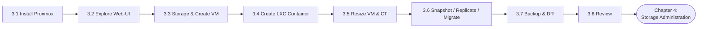
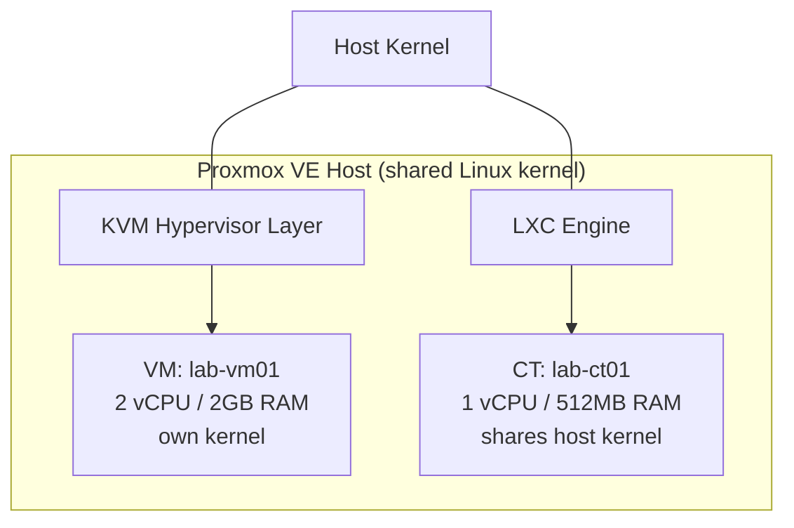
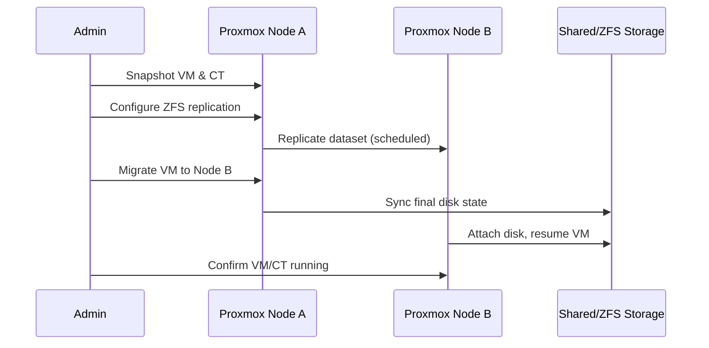
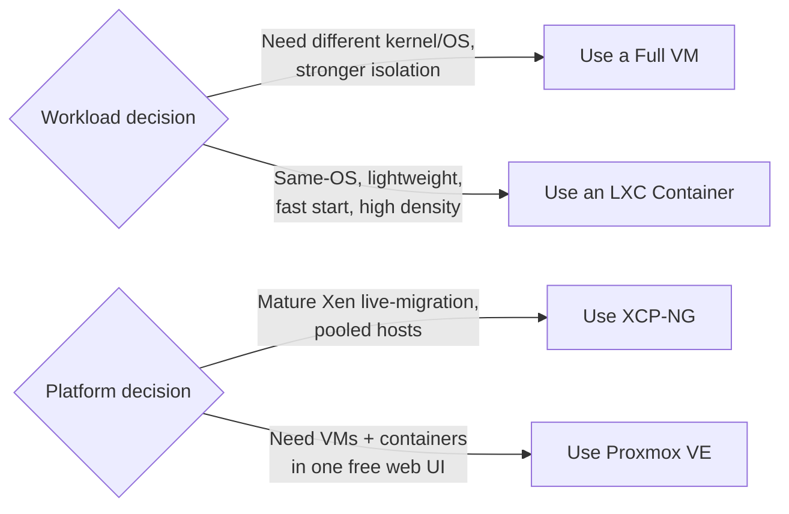

# Chapter 3 — Install & Configure Proxmox

*Part 3 of 4 — Virtualization & Containerization Training Guidebook*
*Day 06 – Day 08 | 8 Sessions | ~570 minutes total*

**Previous:** `Chapter-2-Install-Configure-XCPNG.md` **Next:** `Chapter-4-Storage-Administration.md`

---

This chapter mirrors Chapter 2's structure on the Proxmox VE platform, adding LXC containers — a capability XCP-NG does not provide natively — and repeating the storage, snapshot, migration and disaster-recovery workflow so students can directly compare both platforms.


*Figure 3.1 — Chapter 3 session flow.*

## Session 3.1 — Install Proxmox & Complete the Lab Preparation
*(60 min, Day-06)*

**Session Goal:** Get a second (or repurposed) lab server running Proxmox VE.

### Steps
1. Boot the lab server from the Proxmox VE USB installer prepared in Session 1.6.
2. Accept the license, select the target disk, and choose the filesystem (ext4 for a simple lab, or ZFS/RAID-Z if you want built-in software RAID and snapshots at the host filesystem level).
3. Set location/timezone, then the root password and an admin email address for alerts.
4. Configure the management network: hostname (FQDN, e.g. `pve-lab01.lab.local`), static IP, gateway and DNS, matching your Session 1.6 plan (use a different address than the XCP-NG host if both run concurrently).
5. Confirm and start installation; the host reboots automatically when done.

```bash
# From the workstation, confirm the host answers
ping 192.168.50.20
ssh root@192.168.50.20
```

**Checklist**
- [ ] Proxmox VE installed and reachable via ping/SSH

## Session 3.2 — Basic Configuration & Explore the Web-UI of Proxmox
*(60 min, Day-06)*

**Session Goal:** Get comfortable navigating the built-in Proxmox web management interface.

### Steps
1. Browse to `https://192.168.50.20:8006` from the management workstation and accept the self-signed certificate warning.
2. Log in as `root` with the password set during installation.
3. If the "No valid subscription" popup appears, this is expected on the free/community repository — click OK to dismiss.
4. Switch the host from the Enterprise repository to the free No-Subscription repository:

```bash
# Edit or replace the enterprise repo file
nano /etc/apt/sources.list.d/pve-enterprise.list
# comment out its single line, then add the free repo:
echo "deb http://download.proxmox.com/debian/pve bookworm pve-no-subscription" \
  > /etc/apt/sources.list.d/pve-no-subscription.list
apt update && apt full-upgrade -y
```

5. Tour the UI: Datacenter view, node summary (CPU/RAM/disk graphs), Storage, and the built-in Shell console.

**Checklist**
- [ ] Web UI accessible
- [ ] Repository switched to no-subscription and system updated

## Session 3.3 — Storage Configuration & Create Virtual Machine
*(90 min, Day-06)*

**Session Goal:** Configure disk storage and create a first KVM-based VM.

### Storage
1. From Datacenter → Storage → Add, add a Directory or LVM-Thin storage backed by the spare disk identified in Chapter 2.
2. If ZFS was chosen at install, confirm the `local-zfs` storage pool already exists and note its available capacity.
3. Optionally add an NFS storage target for later migration testing (same NFS export used in Chapter 2, or a new one).

### Create a VM
4. Upload the Linux ISO (from Session 1.6) via Storage → local → ISO Images → Upload, or download directly via URL.
5. Click Create VM: set VM ID and name, select the ISO, choose OS type, set 2 vCPU / 2 GB RAM, and a 20 GB disk on the storage created above.
6. Finish the wizard and start the VM; open its Console tab (noVNC) and complete the guest OS installation.

**Checklist**
- [ ] Storage backend configured and visible in UI
- [ ] VM created and guest OS installed

## Session 3.4 — Create LXC Container and Explore It
*(60 min, Day-07)*

**Session Goal:** Provision and use a lightweight LXC container — Proxmox's key differentiator over XCP-NG.


*Figure 3.2 — VM (KVM) vs. LXC container on the same Proxmox host.*

### Steps
1. Download an LXC template from Datacenter → node → local (or CT Templates) → Templates, e.g. `debian-12-standard`.
2. Click Create CT: set hostname, root password (or SSH key), select the downloaded template.
3. Assign resources: 1 vCPU, 512 MB RAM, 8 GB disk — deliberately smaller than the VM to illustrate the resource efficiency of containers.
4. Configure the container's network (static IP or DHCP) on the same bridge as the VM.
5. Start the container and open its console; log in and run basic commands to confirm it behaves like a normal Linux system:

```bash
hostnamectl
ip a
uname -r      # note: shares the host kernel, unlike a VM
```

6. Compare boot time and resource usage of the container against the VM created in Session 3.3 using `pct list` and `qm list` on the host.

> **Note:** An LXC container shares the host's kernel — this is why it starts almost instantly and uses far less RAM than a VM, but also why it cannot run a different kernel/OS family than the host.

**Checklist**
- [ ] LXC container created, started, and explored via console
- [ ] Boot time / resource difference vs. VM observed

## Session 3.5 — Understand & Modify Resources for VM and Container
*(60 min, Day-07)*

**Session Goal:** Practice safe resource resizing for both VM and container workloads.

### Steps
1. VM: Shut the VM down, open Hardware tab, edit Memory and Processors, then start it and confirm with `free -h` / `nproc` inside the guest.
2. VM disk: increase disk size from Hardware → Disk → Resize, then extend the filesystem inside the guest as in Session 2.5.
3. Container: containers can often be resized live — adjust Memory and swap from the CT's Resources tab and observe the change take effect without a restart.
4. Container root disk: use Resize on the CT's rootfs entry, then grow the filesystem from the host if required:

```bash
pct resize <CTID> rootfs +4G
```

**Checklist**
- [ ] VM resource resize verified
- [ ] Container resource resize verified

## Session 3.6 — Snapshot, Replication & Migration
*(90 min, Day-07)*

**Session Goal:** Repeat the Chapter 2 protection workflow, this time on Proxmox, for both VM and CT.


*Figure 3.3 — Proxmox snapshot, replication and migration workflow.*

### Snapshots
1. Take a snapshot of the VM and, separately, of the LXC container from their respective Snapshots tabs.
2. Make a test change in each, then roll back and confirm the change is reverted.

### Replication
3. If ZFS storage is in use, configure storage replication under the VM/CT's Replication tab, targeting a second Proxmox node if the lab has one, or documenting the steps if only one node is available.

### Migration
4. With shared storage (NFS) attached, use Migrate on the VM to move it between nodes (requires a 2-node cluster); on a single-node lab, perform an offline storage migration between local storage pools instead:

```bash
qm move-disk <VMID> <disk> <target-storage>
```

**Checklist**
- [ ] Snapshot/rollback tested on both VM and CT
- [ ] Migration or storage-move performed and verified

## Session 3.7 — Disaster Recovery Planning, Backup & Restore
*(150 min, Day-08)*

**Session Goal:** Build a complete, tested DR procedure for the Proxmox environment.

### Steps
1. Define RPO/RTO targets for the VM and container, same as Session 2.7.
2. Add a Backup storage target (Directory or NFS) under Datacenter → Storage.
3. Create a Backup job (Datacenter → Backup → Add) scheduling nightly `vzdump` backups of both the VM and the container.
4. Trigger the job manually and confirm success in Task History; inspect the resulting backup files:

```bash
ls -lh /var/lib/vz/dump/
```

5. Simulate a disaster: destroy the test VM and container.
6. Restore both from the Backup tab's Restore action, verify they boot and that application/user data matches expectations.
7. Update the one-page DR runbook from Chapter 2 with the Proxmox-specific restore steps, so the final runbook covers both platforms.

**Checklist**
- [ ] Backup job scheduled and successfully tested
- [ ] Both VM and CT restored and validated
- [ ] Combined two-platform DR runbook completed

## Session 3.8 — Q & A Session with Class Review
*(30 min, Day-08)*

**Session Goal:** Consolidate Chapter 3 and compare both platforms directly.

- Recap install → web UI → storage → VM/CT creation → resource management → snapshot/replication/migration → backup/DR, on Proxmox.
- Class discussion: for a given workload, when would you choose a full VM vs. an LXC container? When would you choose XCP-NG vs. Proxmox?
- Confirm every student has one running VM, one running container, and one valid backup of each before Chapter 4.


*Figure 3.4 — Decision guide: VM vs. container, XCP-NG vs. Proxmox.*

**Checklist**
- [ ] All Chapter 3 session checklists completed by every student

---
**Previous:** `Chapter-2-Install-Configure-XCPNG.md` **Next:** `Chapter-4-Storage-Administration.md`
