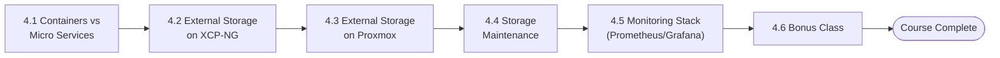
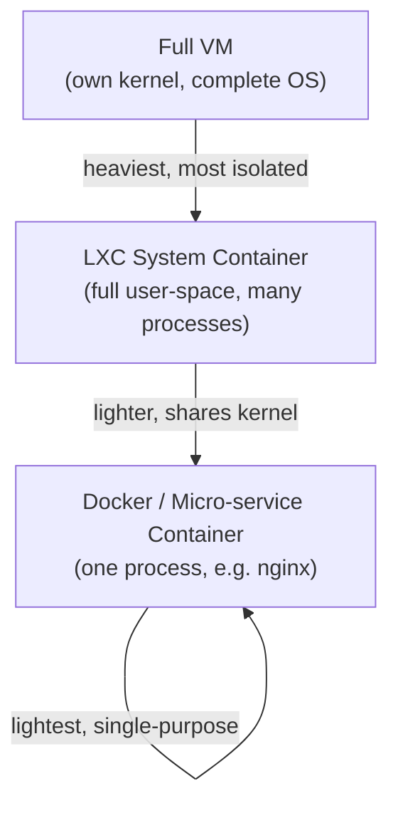
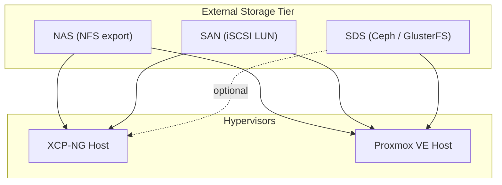
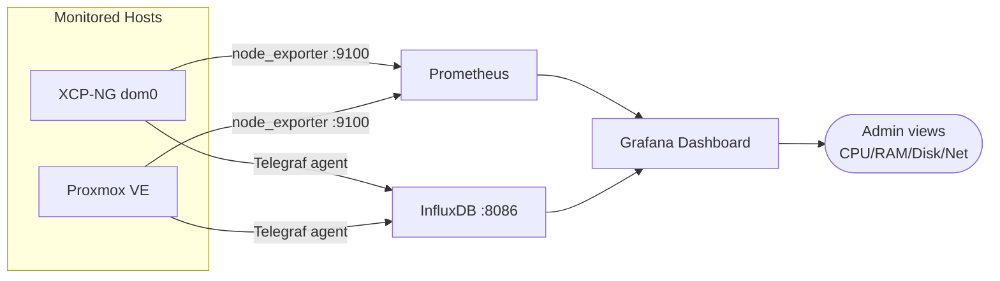
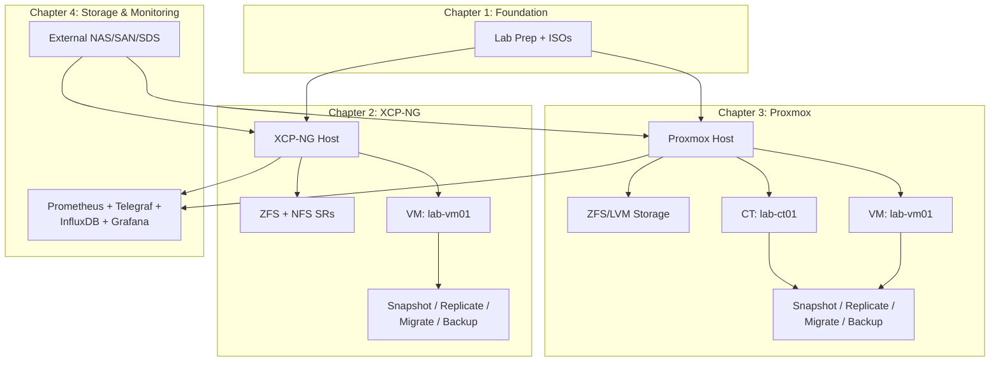

# Chapter 4 — Storage Administration for Virtualization

*Part 4 of 4 — Virtualization & Containerization Training Guidebook*
*Day 09 – Day 12 | 6 Sessions | ~720 minutes total*

**Previous:** `Chapter-3-Install-Configure-Proxmox.md`

---

The final chapter moves beyond local disks to external, shared storage (NAS/SAN/SDS) for both platforms, adds ongoing storage maintenance and monitoring practice, and closes with full-stack resource monitoring using Prometheus, Telegraf, InfluxDB and Grafana.


*Figure 4.1 — Chapter 4 session flow.*

## Session 4.1 — Review Discussion on XCP-NG, Proxmox, Container & Micro Services (Docker)
*(60 min, Day-09)*

**Session Goal:** Bridge from container basics (LXC) to application-level containers (Docker) before the storage-heavy sessions.

### Discussion Points
- Recap the XCP-NG vs. Proxmox comparison from Chapter 3 with real numbers from each student's own lab (boot times, resource use, migration experience).
- Contrast LXC (system containers, a full OS user-space) with Docker (application containers, typically one process per container).
- Explain that Docker can run either directly on a Linux host, inside a Proxmox VM, or inside a privileged/unprivileged LXC container (with trade-offs each way).


*Figure 4.2 — Isolation/weight spectrum: VM → LXC → Docker.*

### Optional Hands-On
1. Inside a Proxmox VM or a Debian LXC container, install Docker and run a test container:

```bash
curl -fsSL https://get.docker.com | sh
docker run --rm hello-world
```

**Checklist**
- [ ] Can articulate container vs. micro-service distinction
- [ ] Docker installed and smoke-tested in the lab (optional)

## Session 4.2 — Adding External Storage (NAS/SAN/SDS) to XCP-NG
*(120 min, Day-09)*

**Session Goal:** Attach a shared external storage system to the XCP-NG host from Chapter 2.

### Steps
1. Choose the external storage protocol available in your lab: NFS (NAS), iSCSI (SAN), or a software-defined option such as GlusterFS/Ceph (SDS).

**NFS example**

2. Confirm the external NAS/NFS server has an export reachable from the XCP-NG host, then in XOA: New → Storage → NFS, enter the server IP and export path.

**iSCSI example**

3. On the XCP-NG host, discover and log in to the iSCSI target:

```bash
iscsiadm -m discovery -t sendtargets -p <SAN-IP>
iscsiadm -m node --login
```

4. In XOA: New → Storage → iSCSI, select the discovered target and the LUN to use, then format/attach it as an SR.
5. Migrate or create a VM's disk on the new external SR and confirm it boots correctly from external storage.
6. Document IOPS/latency expectations by running a basic throughput test from within a guest on the new SR:

```bash
dd if=/dev/zero of=testfile bs=1M count=1024 oflag=direct
```

**Checklist**
- [ ] External storage attached as a new SR
- [ ] VM successfully running from external storage

## Session 4.3 — Adding External Storage (NAS/SAN/SDS) to Proxmox
*(120 min, Day-10)*

**Session Goal:** Repeat Session 4.2's exercise on Proxmox, comparing the configuration workflow.


*Figure 4.3 — External storage (NAS/SAN/SDS) shared by both hypervisor platforms.*

### Steps
1. NFS: Datacenter → Storage → Add → NFS, enter the server and export; select content types (Disk image, ISO, Backup) to enable on it.
2. iSCSI: Datacenter → Storage → Add → iSCSI, enter the portal IP; Proxmox auto-discovers targets. Add an LVM on top of the iSCSI LUN for VM disk storage (Add → LVM, select the iSCSI-backed base storage).
3. SDS (Ceph): if the lab has 3+ nodes with spare disks, this is the point to introduce `pveceph install` and building an OSD-backed Ceph pool — otherwise cover the workflow conceptually.
4. Create or migrate a VM/CT disk onto the new external storage and boot it to confirm functionality.
5. Run the same throughput test from Session 4.2 for a direct platform comparison:

```bash
dd if=/dev/zero of=testfile bs=1M count=1024 oflag=direct
```

**Checklist**
- [ ] External storage attached on Proxmox
- [ ] Throughput results compared against the XCP-NG figures from Session 4.2

## Session 4.4 — Storage Maintenance & Monitoring
*(60 min, Day-10)*

**Session Goal:** Establish ongoing storage health-check habits on both platforms.

### Steps
1. Check underlying disk health with SMART on each host:

```bash
smartctl -a /dev/sda
```

2. For ZFS pools, schedule a periodic scrub and review pool health:

```bash
zpool scrub data_pool
zpool status data_pool
```

3. Review storage capacity thresholds in both XOA and the Proxmox UI; set an alert/reminder for when any SR/storage crosses 80% used.
4. Confirm backup jobs from Chapters 2 and 3 are not silently filling the backup target — check retention settings and prune old backups if needed.
5. Write a short weekly storage-maintenance checklist for production use (SMART check, scrub/status, capacity review, backup retention review).

**Checklist**
- [ ] SMART and pool health checked on both hosts
- [ ] Weekly maintenance checklist documented

## Session 4.5 — Resource Monitoring with Prometheus, Telegraf, InfluxDB & Grafana
*(180 min, Day-11)*

**Session Goal:** Stand up a full monitoring stack covering both the XCP-NG and Proxmox hosts.


*Figure 4.4 — Monitoring stack: Telegraf/Prometheus → InfluxDB → Grafana.*

### Steps
1. Provision a dedicated monitoring VM/CT (2 vCPU, 4 GB RAM) on either platform.
2. Install Docker on the monitoring VM (see Session 4.1) to simplify deploying the stack as containers, or install each component natively via each project's package repository.
3. Deploy InfluxDB (time-series database) and expose its default port (8086).
4. Deploy Telegraf as the metrics collection agent; configure its `[[outputs.influxdb_v2]]` section to point at InfluxDB, and enable the `[[inputs.cpu]]`, `[[inputs.mem]]`, `[[inputs.disk]]`, and `[[inputs.net]]` input plugins.
5. Install a Telegraf agent on both the XCP-NG dom0 host (via SSH-accessible package repo or a manual binary install) and the Proxmox host so both report into the same InfluxDB.
6. Deploy Prometheus alongside `node_exporter` on each host for kernel/host-level metrics not covered by Telegraf, and add both hosts as scrape targets in `prometheus.yml`:

```yaml
scrape_configs:
  - job_name: 'hosts'
    static_configs:
      - targets: ['192.168.50.10:9100', '192.168.50.20:9100']
```

7. Deploy Grafana, add both InfluxDB and Prometheus as data sources, and import (or build) a dashboard showing CPU, memory, disk and network for both hosts side by side.
8. Confirm live data is flowing by generating load on a VM (e.g. `stress-ng --cpu 2 --timeout 60s`) and watching the corresponding graph react in Grafana.

**Checklist**
- [ ] InfluxDB, Telegraf, Prometheus and Grafana all running
- [ ] Both hypervisor hosts reporting metrics
- [ ] A working Grafana dashboard confirmed with live load test

## Session 4.6 — Bonus Class
*(180 min, Day-12)*

**Session Goal:** Open lab time to reinforce weak areas and explore optional extensions.

### Suggested Activities (trainer's choice based on class needs)
- Build a 2-node cluster on either platform (Proxmox clustering via `pvecm`, or an XCP-NG pool) and repeat live migration across real separate hosts.
- Configure Grafana alerting (e.g. an email/webhook alert when disk usage exceeds 80%) building on Session 4.5's dashboard.
- Re-run any Chapter 2–4 checklist item that a student did not fully complete during the scheduled session.
- Open Q&A covering the full course, and a short written or hands-on review quiz covering install, storage, snapshot/migration, and monitoring across both platforms.

**Checklist**
- [ ] Every student has completed all checklists in Chapters 1–4
- [ ] Course review quiz or practical assessment completed

---

## Appendix A — Full Command Quick Reference

### XCP-NG / Xen host
```bash
xe host-list
xe vm-list
xe sr-list
xe vm-snapshot uuid=<vm-uuid> new-name-label=snap1
```

### Proxmox VE
```bash
qm list                  # list VMs
pct list                 # list containers
qm start <VMID>
pct start <CTID>
vzdump <VMID|CTID> --storage <target>   # manual backup
```

### Storage & Monitoring
```bash
zpool status
smartctl -a /dev/sdX
iscsiadm -m session
systemctl status telegraf prometheus grafana-server
```

## Appendix B — Course Completion Checklist

- [ ] Chapter 1: Lab hardware/network prepared, installers ready
- [ ] Chapter 2: XCP-NG installed, storage/VM/snapshot/replication/migration/backup all demonstrated
- [ ] Chapter 3: Proxmox installed, storage/VM/CT/snapshot/replication/migration/backup all demonstrated
- [ ] Chapter 4: External storage attached on both platforms, maintenance routine documented, full monitoring stack live

## Appendix C — Full Course Architecture (All Chapters)


*Figure 4.5 — End-to-end architecture covered across all four chapters.*

---
**Previous:** `Chapter-3-Install-Configure-Proxmox.md` · **Course complete.**
